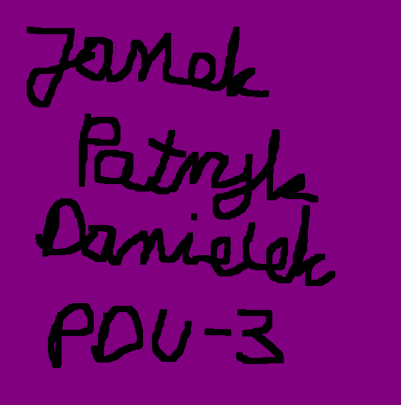

<!--
PROJECT TEMPLATE BY Othneil Drew (othneildrew)
check his repository: https://github.com/othneildrew/Best-README-Template
I HAVE KEPT HIS COMMENTS

*** Thanks for checking out the Best-README-Template. If you have a suggestion
*** that would make this better, please fork the repo and create a pull request
*** or simply open an issue with the tag "enhancement".
*** Thanks again! Now go create something AMAZING! :D
-->


<!-- PROJECT SHIELDS -->
<!--
*** I'm using markdown "reference style" links for readability.
*** Reference links are enclosed in brackets [ ] instead of parentheses ( ).
*** See the bottom of this document for the declaration of the reference variables
*** for contributors-url, forks-url, etc. This is an optional, concise syntax you may use.
*** https://www.markdownguide.org/basic-syntax/#reference-style-links
-->
[![Contributors][contributors-shield]][contributors-url]
[![Forks][forks-shield]][forks-url]
[![Stargazers][stars-shield]][stars-url]
[![Issues][issues-shield]][issues-url]
[![MIT License][license-shield]][license-url]
[![LinkedIn][linkedin-shield]][linkedin-url]


<!-- PROJECT LOGO -->
<br />
<p align="center">
  <a href="https://github.com/janskwr/IiAD-PDU-PD3">
    
  </a>

  <h3 align="center">IiAD-PDU-PD3</h3>

  <p align="center">
    Our project for Processing of structured data!
    <br />
    <a href="https://github.com/janskwr/IiAD-PDU-PD3"><strong>Explore the docs »</strong></a>
    <br />
    <br />
    <a href="https://github.com/janskwr/IiAD-PDU-PD3">View Demo</a>
    ·
    <a href="https://github.com/janskwr/IiAD-PDU-PD3/issues">Report Bug</a>
    ·
    <a href="https://github.com/janskwr/IiAD-PDU-PD3/issues">Request Feature</a>
  </p>
</p>


<!-- TABLE OF CONTENTS -->
<details open="open">
  <summary>Table of Contents</summary>
  <ol>
    <li>
      <a href="#about-the-project">About The Project</a>
    </li>
    <li>
      <a href="#requirements">Requirements</a>
    </li>
    <li><a href="#installation">Installation</a></li>
    <li><a href="#contributing">Contributing</a></li>
    <li><a href="#license">License</a></li>
    <li><a href="#authors">Authors</a></li>
    <li><a href="#contact">Contact</a></li>
  </ol>
</details>


<!-- ABOUT THE PROJECT -->
## About The Project

[![Our analysis ][product-screenshot]](https://www.youtube.com/watch?v=3hK8VyXFkZE "Our analysis")

It's our project for Processing of structured data. It basically analyzes data from large stackexchange and creates cool diagrams. We explain everything in the video above. Click on a photo and it will redirect you to youtube. 


<!-- REQUIREMENTS -->
## Requirements

* [GNU R version 4](https://www.r-project.org/)
* [Package stringi](https://cran.r-project.org/web/packages/stringi/index.html)
* [Package data.table](https://cran.r-project.org/web/packages/data.table/index.html)
* [Package XML](https://cran.r-project.org/web/packages/XML/index.html)
* [gaming.stackexchange.com.7z](https://archive.org/details/stackexchange)
* [beer.stackexchange.com.7z](https://archive.org/details/stackexchange)
* [health.stackexchange.com.7z](https://archive.org/details/stackexchange)
* [any integrated development environment for R (we recommend using RStudio)](https://www.rstudio.com/)


<!-- INSTALLATION -->
## Installation

1. Download/clone all files from this repository.
2. Open folder with files in terminal.
3. Type:
```bash
./requirements.sh
```
4. If it doesn't work try:
```bash
sudo chmod +x requirements.sh
```
&nbsp;&nbsp;&nbsp;&nbsp;&nbsp;&nbsp;&nbsp;and then again:
```bash
./requirements.sh
```
5. Unpack 7z folders with data and place them in appropriately named folders created inside project directory:
```bash
gaming.stackexchange.com.7z ---> gaming_stackexchange
beer.stackexchange.com.7z ---> beer_stackexchange
health.stackexchange.com.7z ---> health_stackexchange
```
6. Now you can open and use our R program with full functionality!


<!-- CONTRIBUTING -->
## Contributing

Contributions are what make the open source community such an amazing place to be learn, inspire, and create. Any contributions you make are **greatly appreciated**.

1. Fork the Project
2. Create your Feature Branch (`git checkout -b feature/AmazingFeature`)
3. Commit your Changes (`git commit -m 'Add some AmazingFeature'`)
4. Push to the Branch (`git push origin feature/AmazingFeature`)
5. Open a Pull Request


<!-- LICENSE -->
## License

Distributed under the MIT License. See `LICENSE` for more information.


<!-- LICENSE -->
## Authors

* [Patryk Rakus](https://github.com/rakusp)
* [Jan Skwarek](https://github.com/janskwr)
* [Daniel Tytkowski](https://github.com/tytkowskid)


<!-- CONTACT -->
## Contact

* Jan Skwarek - janskwarek@protonmail.ch - [Instagram](https://www.instagram.com/janskwr/) - [Facebook](https://www.facebook.com/jan.skwarek) - [LinkedIn](https://www.linkedin.com/in/jan-skwarek-87b01419b/)
* Daniel Tytkowski
* Patryk Rakus

Project Link: [https://github.com/janskwr/IiAD-PDU-PD3](https://github.com/janskwr/IiAD-PDU-PD3)


<!-- MARKDOWN LINKS & IMAGES -->
<!-- https://www.markdownguide.org/basic-syntax/#reference-style-links -->
[contributors-shield]: https://img.shields.io/github/contributors/janskwr/IiAD-PDU-PD3.svg?style=for-the-badge
[contributors-url]: https://github.com/janskwr/IiAD-PDU-PD3/graphs/contributors
[forks-shield]: https://img.shields.io/github/forks/janskwr/IiAD-PDU-PD3.svg?style=for-the-badge
[forks-url]: https://github.com/janskwr/IiAD-PDU-PD3/network/members
[stars-shield]: https://img.shields.io/github/stars/janskwr/IiAD-PDU-PD3.svg?style=for-the-badge
[stars-url]: https://github.com/janskwr/IiAD-PDU-PD3/stargazers
[issues-shield]: https://img.shields.io/github/issues/janskwr/IiAD-PDU-PD3.svg?style=for-the-badge
[issues-url]: https://github.com/janskwr/IiAD-PDU-PD3/issues
[license-shield]: https://img.shields.io/github/license/janskwr/IiAD-PDU-PD3.svg?style=for-the-badge
[license-url]: https://github.com/janskwr/IiAD-PDU-PD3/blob/master/LICENSE.txt
[linkedin-shield]: https://img.shields.io/badge/-LinkedIn-black.svg?style=for-the-badge&logo=linkedin&colorB=555
[linkedin-url]: https://www.linkedin.com/in/jan-skwarek-87b01419b/
[product-screenshot]: images/screenshot.png
